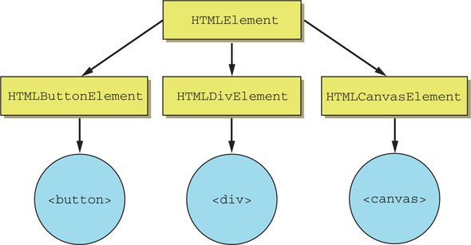

# Пользовательские элементы

Спецификация *Custom Elements* является основой для разработки Веб Компонентов, ведь именно она дала возможность разработчикам расширять существующие нативные элементы, а также создавать новые HTML-элементы с нуля или на основе внешних кодовых баз. Это поддерживаемый веб-стандартами путь к созданию переиспользуемых компонентов на ванильных JS/HTML/CSS.

Мы можем создавать пользовательские HTML-элементы, описываемые нашим классом, со своими методами и свойствами, событиями и так далее. Мы можем определить их с помощью специального класса, а затем использовать, как если бы они всегда были частью HTML.

Когда мы добавляем элемент на страницу, нас редко волнует, как он работает внутри, но сейчас придется разобраться. Вспомним концепцию наследования, основу объектно-ориентированного программирования. Почти все элементы, которые мы размещаем в HTML/DOM, наследуются от класса `HTMLElement`. Так, элементы ``, `
` и `<button>` создаются через `HTMLSpanElement`, `HTMLDivElement` и `HTMLButtonElement` соответственно. Все они наследуются от `HTMLElement`.

Если выполнить в браузере команду `document.createElement('div').constructor`, консоль вернет `ƒ HTMLDivElement() { [native code] }`.

Существует два вида пользовательских элементов:
1. Автономные пользовательские элементы – «полностью новые» элементы, расширяющие абстрактный класс HTMLElement.
2. Пользовательские встроенные элементы – элементы, расширяющие встроенные, например кнопку HTMLButtonElement и т.п.

Сначала мы познакомимся с их общими чертами, затем - с пользовательскими встроенными элементами, а после - перейдем к автономным.
