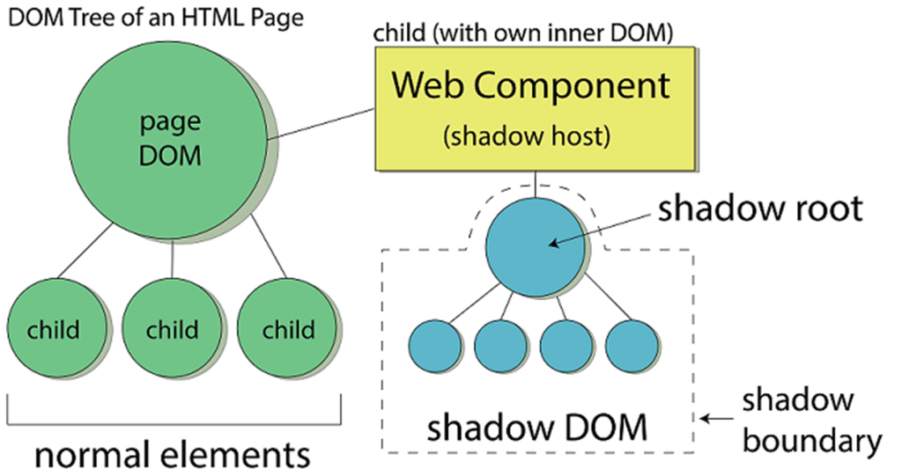
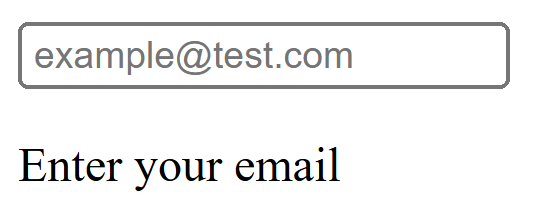
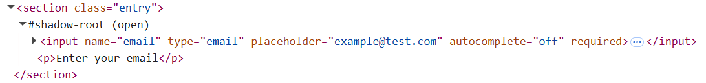

# Shadow DOM

`Shadow DOM` - браузерный стандарт, предоставляющий инкапсуляцию для HTML-элементов, изолируя его содержимое от остальной части DOM-дерева. Причем мы можем изолировать не только разметку, но также `<style>` и `<script>`.

Существуют два вида DOM-деревьев: обычные (Light DOM) и теневые (Shadow DOM). До текущего момента мы работали только с обычными DOM-деревьями. Они находится в глобальной области видимости документа, доступны при поиске через `document.querySelector` и подобные ему методы. Для стилизации таких элементов мы встраиваем тэги `<style>` в `<head>` документа, а для добавления интерактивности используем тэг `<script>` в `<head>` либо перед закрытием `<body>`.

Если таблиц стилей или скриптов не один, а несколько, как обычно бывает в сложных приложениях, это может приводить к коллизиям. `Shadow DOM` призван решить эту проблему. Теневые DOM-деревья спрятаны от пользователей, не отражены в HTML-разметке.

При этом, мы не обязаны использовать `Shadow DOM` при создании Веб Компонентов - это лишь один из путей.

## Терминология

*Shadow host* - компонент, владеющий теневым деревом. Не каждый элемент способен стать хостом: для этого он должен быть способен содержать в себе контент (например, изображение или поле ввода стать хостами не могут, а любой контейнерный или блочный текстовый элемент - могут).

*Shadow root* - корневой узел теневого поддерева. Может быть лишь один корневой узел на компонент. Может работать в двух режимах: открытом и закрытом. Открытый режим делает дерево доступным к обходу средствами JS. В закрытом доступ можно получить только через ссылку, возвращаемую при прикреплении теневого дерева, которая как правило инкапсулирована.

*Shadow DOM* - изолированный теневой участок DOM. Идентификаторы его элементов могут повторять уже использующиеся в обычном DOM, и конфликтов не будет. Особенности стилизация таких элементов будут рассмотрены ниже.

*Shadow boundary*: граница, проходящая между *Shadow host* и *Shadow root*



## Использование в нативных элементах

`Shadow DOM` используется в целом ряде нативных HTML-элементов. Например, посмотрим на `<input type="date">`

<input name="date" type="date">

Тег предоставляет текстовое поле ввода с валидацией, всплывающее окно с календарем, альтеративное отображение на мобильных устройствах. Если обратить внимание на его функционал, становится ясно, что разметка и стилизация не может быть такой простой.

Если мы включим в *инструментах разработчика* развернутое отображение теневых деревьев, то получим более интересную картину

```js
<input type="date">
    #shadow-root (user-agent)
        <div pseudo="-internal-datetime-container" style="unicode-bidi: normal;">
            <div pseudo="-webkit-datetime-edit" id="date-time-edit" datetimeformat="dd.MM.yyyy" style="unicode-bidi: normal;">
                <div pseudo="-webkit-datetime-edit-fields-wrapper" style="unicode-bidi: normal;">
                    <span role="spinbutton" aria-placeholder="дд" aria-valuemin="1" aria-valuemax="31" aria-label="День" pseudo="-webkit-datetime-edit-day-field">дд</span>
                    <div pseudo="-webkit-datetime-edit-text" style="unicode-bidi: normal;">.</div>
                    <span role="spinbutton" aria-placeholder="мм" aria-valuemin="1" aria-valuemax="12" aria-label="Месяц" pseudo="-webkit-datetime-edit-month-field">мм</span>
                    <div pseudo="-webkit-datetime-edit-text" style="unicode-bidi: normal;">.</div>
                    <span role="spinbutton" aria-placeholder="гггг" aria-valuemin="1" aria-valuemax="275760" aria-label="Год" pseudo="-webkit-datetime-edit-year-field">гггг</span>
                </div>
            </div>
            <div pseudo="-webkit-calendar-picker-indicator" id="picker" tabindex="0" aria-haspopup="menu" role="button" title="Показать окно выбора даты"></div>
        </div>
</input>
```

Если попробуем прописать им стили привычным образом, применится только та часть, которая относится к `Light DOM`. В случае нативных элементов, разработанных еще до введения стандарта, доступ можно получить через значение аттрибута *pseudo*, можете поэкспериментировать самостоятельно.

```css
input[type="date"] {
    font-size: 2rem;
}

span[role="spinbutton"] {
    color: pink;
}
```

Теперь попробуем обратиться к любому из этих теневых элементов через JavaScript

```js
const inputElement = document.querySelector('input[type="date"]')
console.log(inputElement)
// <input name=​"date" type=​"date">​…​</input>​

const inputFieldElements = inputElement.querySelectorAll('span[role="spinbutton"]')
console.log(inputFieldElements)
// NodeList []
```

Аналогично можете обследовать самостоятельно нативный элемент для воспроизведения аудио:

<audio controls>
    <source src="../assets/windows-error.wav" type="audio/wav">
</audio>

Таким образом, внутреннее устройство элемента защищено от непредусмотренных программных взаимодействий и стилизации.

## Использование Shadow DOM с обычными элементами

В последующих разделах мы рассмотрим связку теневого дерева с пользовательскими элементами, а пока познакомимся на примере обычных.

Создадим связку `input` + `p`, запакованную в `section`, для отображения поля ввода с подсказкой / сообщением об ошибке заполнения.

Элемент `section` создадим как обычно, а содержимое - в теневом дереве.

```html
<body>
    <section class="entry"></section>
    <script>
        const sectionElement = document.querySelector('.entry')
        const shadow = sectionElement.attachShadow({ mode: 'open' })
        shadow.innerHTML = `
            <input name="email" type="email" placeholder="example@test.com" autocomplete="off" required>
            <p>Enter your email</p>`
    </script>
</body>
```

Это создаст следующую разметку:




Теперь попробуем получить доступ к элементам теневого дерева:

```js
const emailInputElement = sectionElement.querySelector('input')
const emailTipElement = sectionElement.querySelector('p')
console.log(emailInputElement, emailTipElement) // null null
```

Как видим, так просто элементы найти не удается. Но есть обходной путь:

```js
const emailInputElement = sectionElement.shadowRoot.querySelector('input')
const emailTipElement = sectionElement.shadowRoot.querySelector('p')
console.log(emailInputElement, emailTipElement)
// <input name="email" type="email" placeholder="example@test.com" autocomplete="off" required="">
// <p>Enter your email</p>
```

Такая возможность есть, так как при прикреплении корня был выбран `mode: "open"`. Заменим на `closed` и проверим:

```js
const shadow = sectionElement.attachShadow({ mode: 'closed' })

/* ... */

const emailInputElement = sectionElement.querySelector('input')
console.log(emailInputElement) // null

const emailTipElement = sectionElement.shadowRoot.querySelector('p')
console.log(emailTipElement) // TypeError: Cannot read properties of null (reading 'querySelector')

const emailTipElement = shadow.querySelector('p')
console.log(emailTipElement) // <p>Enter your email</p>
```

Первый вариант всё еще отдает `null`, как и ожидалось. Второй вариант, с доступом через `shadowRoot`, теперь выдает ошибку - в закрытом режиме получить к нему доступ невозможно. Третий вариант работает через ссылку на `shadowRoot` и отдает элемент, но в реальной практике построение компонентов происходит в области видимости функции либо, что чаще, класса, поэтому снаружи доступа к теневому дереву не будет.

## Работа со стилями

Без стилей наш компонент выглядит так:

<iframe src="/shadow-dom-example.html"  />

Добавим глобальные стили и посмотрим, какие из них применятся:

```css
body {
    --padding-small: 0.5rem;
}

.entry {
    box-shadow: 0px 0px 3px 2px rgba(34, 60, 80, 0.23);
    padding: 8px;
    font-weight: 600;
}

input[type="email"]::placeholder {
    color: pink;
}

p {
    color: pink;
}
```

<iframe src="/shadow-dom-example-2.html"  />

Применились только те глобальные стили, которые относятся к элементу *.entry*, относящемуся к `Light DOM`. Теперь добавим локальные стили:

```html
<script>
    const sectionElement = document.querySelector('.entry')
    const shadow = sectionElement.attachShadow({ mode: 'closed' })
    shadow.innerHTML = `
        <style>
            body {
                max-width: fit-content;
            }

            .entry {
                display: none;
            }

            :host {
                font-weight: 400;
                box-shadow: none !important;
            }

            input[type="email"] {
                padding: var(--padding-small);
            }

            input[type="email"]::placeholder {
                color: pink;
            }

            p {
                color: pink;
            }
        </style>
        <input name="email" type="email" placeholder="example@test.com" autocomplete="off" required>
        <p>Enter your email</p>`

    shadow.querySelector('p').style.fontSize = "0.75rem"
</script>
```

<iframe src="/shadow-dom-example-3.html"  />

Выводы:
- локальные стили могут быть помещены прямо в *innerHTML* корня теневого дерева в тэге `<style>`;
- ширина *body* не изменилась - локальные стили не применяются к элементам вне теневого дерева;
- подсказка *p* и плейсхолдер в *input* поменяли цвет на розовый - элементы теневого DOM можно стилизовать локальными стилями;
- внутри поля ввода *input* появились внутренние отступы - CSS-переменные, заданные глобально, доступны внутри теневого дерева;
- размер шрифта подсказки *p* уменьшился - доступ к стилям дочерних элементов через ссылку на корневой элемент теневого дерева есть даже в закрытом режиме;
- *.entry* не перестал отображаться - локальные стили в `<style>` не позволяют обратиться к хостовому элементу, так как для этого нужно подняться на уровень выше;
- зато к хостовому элементу можно обратиться через селектор `:host`, при этом правило с толщиной шрифта применилось, а правило с тенью нет; дело в том, что если хостовой элемент настраивается и глобально, и локально, то в соответствии с каскадной моделью приоритет имеют глобальные стили, если в локальных не задан модификатор *!important*;

Еще раз, кратко. Элементы теневого DOM:
- обладают собственной областью видимости идентификаторов;
- невидимы JavaScript селекторам из главного документа;
- стилизуются своими стилями из теневого дерева, не из главного документа, за исключением настройки через CSS-переменные, которые служат мостиком между теневым и обычным деревьями.

## Будет рассмотрено далее

Для начала этого достаточно. Чуть позже будут дополнительно рассмотрены следующие аспекты работы с теневым деревом:

- слоты и композиция;
- спецификация Shadow Root API;
- спецификация CSS Shadow Parts;
- спецификация Constructable Stylesheets;
- спецификация Declarative Shadow DOM;
- селективная стилизация хост-элемента;
- контекстная стилизация хост-элемента.
