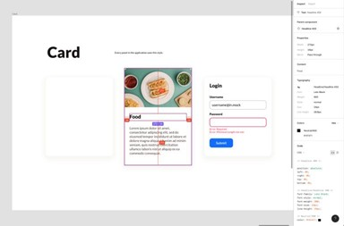

# Компонент <card-component>

## Фигма

Дизайн компонента в [Figma](https://www.figma.com/file/QXGa6qN6AqgeerCtS28I8z/Web-Components-Book-Design-Library?node-id=331%3A24)



## Первые шаги

Создадим директорию `src/lib/component/card`, а в ней два файла: `Card.ts` и `Card.stories.ts`.

Согласно требованиям, `Card.ts` должен экспортировать класс `CardComponent`, являющийся автономным пользовательским элементом. Как мы помним, такие элементы расширяют класс `HTMLElement`.

```ts
// src/lib/component/card/Card.ts

export class CardComponent extends HTMLElement {
    constructor() {
        super();
        const template = document.createElement('template');

        const shadowRoot = this.attachShadow({ mode: 'open' });
        shadowRoot.appendChild(template.content.cloneNode(true));
    }
}

customElements.define('card-component', CardComponent);
```

```ts
// src/lib/component/card/Card.stories.ts

import { CardComponent } from "./Card";

const PrimaryTemplate = () => `<card-component></card-component>`;

export const Card = PrimaryTemplate.bind({});

export default {
    title: "Components/CardComponent",
};
```

## Вспоминаем слоты

Судя по макету, от нас ожидается возможность динамического задания хедера, контента и футера.

Веб Компоненты позволяют использовать Slots API для встраивания различного контента в слоты шаблонов. Напомним особенность, что
контент, настраиваемый для размещения в слоте, остается доступным через обычный DOM (за исключением глубоко вложенных слотов).

Наиболее подходящие семантические элементы для реализации макета - это `<header>`, <section> и <footer>, упакованные в `article`. Задав соответствующие слоты, мы обеспечим возможность их динамического наполнения.

```ts
// src/lib/component/card/Card.ts

export class CardComponent extends HTMLElement {
    constructor() {
        super();
        const template = document.createElement('template');

        template.innerHTML = `
            <article>
                <header><slot name="header"></slot></header>
                <section><slot name="content"></slot></section>
                <footer><slot name="footer"></slot></footer>
            </article>
        `

        const shadowRoot = this.attachShadow({ mode: 'open' });
        shadowRoot.appendChild(template.content.cloneNode(true));
    }
}

customElements.define('card-component', CardComponent);
```

Теперь обновим стори, наполнив компонент статическим содержимым

```ts
// src/lib/component/card/Card.stories.ts

// ...
const PrimaryTemplate = () => `
    <card-component>
        <h4 slot="header">Food</h4>
        <p slot="content">Lorem ipsum dolor sit amet, consectetur adipiscing elit, sed do eiusmod tempor incididunt ut labore et dolore magna aliqua. Ut enim ad minim veniam, quis nostrud exercitation ullamco laboris nisi ut aliquip ex ea commodo consequat.</p>
        <a href="#" slot="footer">Read</a>
    </card-component>`;
// ...
```

Проверьте отображение в Storybook.

Осталось добавить изображение. Стилизацией займемся позже, а пока просто добавим его в шаблон, воспользовавшись тем, что в один слот может быть подставлено более одного элемента.

```ts
// src/lib/component/card/Card.stories.ts

// ...
const PrimaryTemplate = () => `
    <card-component>
        
        <h4 slot="header">Food</h4>
        <p slot="content">Lorem ipsum dolor sit amet, consectetur adipiscing elit, sed do eiusmod tempor incididunt ut labore et dolore magna aliqua. Ut enim ad minim veniam, quis nostrud exercitation ullamco laboris nisi ut aliquip ex ea commodo consequat.</p>
        <a href="#" slot="footer">Read</a>
    </card-component>`;
// ...
```
