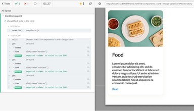

# Тестирование <card-component>

 We’ve established the structure and presentation of this autonomous custom element, but before we close this chapter, let’s add some automated tests.

The importance of testing UI components cannot be understated. You spent some time implementing a stable template for CardComponent and want to ensure it remains intact. That template has a API: the names of the slots engineers expect to project content into: header, content, and footer. Suppose you need to implement a new feature, inadvertently altering the original contract engineers relied on while using the CardComponent. Integration tests can warn you of breaking changes to the component.

While integration tests verify how the different parts of the code work together, snapshot tests alert you to differences in the look and feel of a component after changes to the codebase. Snapshot tests take an impression of the visual appearance of the component at a point in time and then check for differences over time. Throughout this book, you’ll be creating and updating visual regression tests.

If you’re new to testing, the role of tests will become more apparent in later chapters after you refactor the components in Chapter Four, add features or alter user interface behaviors, but for now, let’s use integration tests to verify the CardComponent implemen-tation. In this section, you’ll write integration tests that check if CardComponent has the proper HTML template slots declared in the component’s template. You’ll verify that the content set by the default Storybook Controls is present. After writing these

Getting to Know Web Components	61

integration tests with Cypress, you will generate a snapshot of the ImageCard story using the Storybook StoryShots plugin.

## Интеграционные тесты

Cypress³⁵ is available in the repository for writing automation tests. You’re not expected to know Cypress prior to reading this book, so we’re going to walk through the process of writing tests with Cypress. The actual test files are located in cypress/integration. In the beginning, this directory is empty because no tests have been written yet.

Cypress provides robust framework and tooling for developing integration tests; however, Storybook is still the test bed. Cypress will navigate to views in Storybook and test various parts of each component. If you don’t already have Storybook running, start it now in a Terminal window.

1	yarn storybook

Just like when you click on the Storybook navigation in the sidebar to navigate to the Image Card story, Cypress can navigate to a similar view to test the CardComponent in the browser. Storybook stories are displayed in an embedded <iframe> in the Canvas tab of the Storybook UI. If you inspect the Story using Dev Tools in Google Chrome, you’ll notice the <in-card> tag wrapped by a <body> tag inside a <iframe>.

Storybook provides a way to view stories without the rest of the Storybook UI. By allowing tools like Cypress to navigate to the story in isolation, the test can be more reliable because the test framework may not mistakenly query for elements in the Storybook UI. To see this in action, observe the path in the address bar when you navigate to the Image Card story.

1	http://localhost:6006/?path=/story/components-card--image\

2   -card

The part after /story/ corresponds to the title of the story you defined earlier (Components/Card), followed by the name of the story (ImageCard). Both are converted from pascal case to kebab case to satisfy the requirements of setting the path query param in the address bar.

If you reconfigure the query param to instead query for id instead of path, remove the /story/ and insert iframe.html to the path after the hostname and port and before the query params, you’d end up with something like the below url in the address bar.

Getting to Know Web Components	63

1	http://localhost:6006/iframe.html?id=components-card--ima\

2   ge-card

This address navigates the browser to a view that displays the Image Card story without the rest of the Storybook UI. This is ideal for test frameworks so the component implementation is tested in isolation.

You should understand this because Cypress is configured to test user interfaces running at http://localhost:6006, the same address as Storybook. When coding Cypress tests, you’ll direct the test framework to navigate to the story before any test assertions. You only need the path after the host name and port to specify the address Cypress should visit in the browser prior to running any integration test.

1	cy.visit("iframe.html?id=components-card--image-card"\

2   );

For a description of writing, running, and debugging Cypress tests, reference the online documentation³⁶. To write the integration tests for CardComponent, follow the instructions below.

In a separate Terminal window from Storybook, create a new test file in the cypress/integration directory named Card.spec.js

In the same Terminal window, run Cypress in “open mode”. A built-in script called test:e2e:open is available that calls cypress open.

1	yarn test:e2e:open

If this is your first time running Cypress, you may be prompted by the operating system to install or verify Cypress. Follow any onscreen prompts until you can run yarn test:e2e:open smoothly. Cypress may not be installed globally on your system and that’s fine because it should be installed locally to the project. If you have difficulty running cypress install, try running the same command locally: node_modules/.bin/cypress install.

When Cypress runs in “open mode” the test framework opens a new browser window that includes a user interface for running integration tests.

If you try to run the Card.spec.js integration test right now by clicking on the link in the browser window, nothing would happen because we haven’t written any tests yet. Lets remedy that.

All Cypress tests are wrapped in a describe block like below. Go ahead and write this function in Card.spec.js, passing in the name of the component as the first argument and a function callback in the second argument. The callback is where you’ll write the tests.

1	describe("CardComponent", () => {});

Inside the function block, call the it method with the following requirements. This it function is available via Cypress. Pass in the name of the test as the first argument, followed by another function callback in the second argument. It’s a good idea to provide a name here that describes what this particular test does. For the first test, you’ll check there are slot elements in the CardComponent, so name the test should find slots in the card.

1	describe("CardComponent", () => {

2	it("should find slots in the card", () => {}); 3 });

Inside the it function callback, using the cy keyword navigate Cypress with the visit method, calling this method with the url you figured out earlier that navigates to the Image Card story.

1	cy.visit("iframe.html?id=components-card--image-card"\

2   );

Cypress includes methods for querying DOM nodes, accessing Shadow DOM, and running assertions against DOM nodes on the same cy Object. Some methods you’ll use to assert the slots are located in the Shadow DOM template are as follows:

Method	Purpose
get	    Queries for a DOM element using a selector
	    similar to document.querySelector
shadow	Accesses an element’s Shadow Root
find	Queries for a DOM element inside the
	    context of the query ran with get
should	The assertion for the current test

To test that the Shadow Root of the CardComponent instance includes the slots we intended, use the get method to query for the tag name in-card, then access the Shadow Root with a call to shadow(), chain-ing another call to find, passing in the slot[name="header"] as the selector. Finally call should with the string exist. This statement basically says find the in-card element, access its Shadow Root, then find the slot with the attribute name set to header, and check it exists. Repeat the same process for all three of the slots declared in the Shadow Root.

1	it("should find slots in the card", () => {

2	cy.visit("iframe.html?id=components-card--image-card"\

3   );

4	cy.get("in-card").shadow().find('slot[name="header"]'\ 5 ).should("exist");
6	cy.get("in-card").shadow().find('slot[name="content"]\ 7 ').should("exist");
8	cy.get("in-card").shadow().find('slot[name="footer"]'\ 9 ).should("exist");
10	});

This test ensures if an engineer changes the names of the slots, the test will fail. A breaking change like that to the component could up-set everywhere that instantiates an instance of the CardComponent in the application. That is well and good for testing the slots we’ve defined exist, but what about testing if the content gets correctly projected inside the slot? This is an integration test after all.

Before, you had to traverse the shadow boundary to test if the slot existed, but the actual content going into the slot exists in Light DOM, not Shadow DOM. You’ll need a different way to query for the content when testing if the image exists and text content contains the correct characters. That means you’ll need to query for an element that is a parent node in DOM to <in-card>. Stories are contained by an element with the id #root in Storybook. Use that element to find the elements that are projected into each slot by selecting each element by the slot attribute.

Declare another test using the it function, this time specifying the test should find the card slot content in light DOM.

1	it("should find the card slot content in light DOM", ()\

2	=> {

Call cy.visit with the same address as the first test.

1	cy.visit("iframe.html?id=components-card--image-card"\

2   );

The first test assertion checks an img element exists in the template. When querying for the img to check the image exists, use the [slot="header"] selector, chaining the get method for the img. get starts at the currently selected element and traverses DOM until it finds a match. Since the HTMLImageElement has the same attribute, it matches the same node.

1	cy.get("#root").find('[slot="header"]').get("img").sh\ 2 ould("exist");

Continue testing the content by querying for the remaining ele-ments projected into the header, content, and footer slots, this time asserting the DOM nodes contain specific string characters that are expected.

When you are finished writing the test that verifies that the content is correctly projected into each slot, the test should appear like below.

1	it("should find the card slot content in light DOM", ()\

2	=> {

3	cy.visit("iframe.html?id=components-card--image-card"\

4   );

5	cy.get("#root").find('[slot="header"]').get("img").sh\ 6 ould("exist");
7	cy.get("#root").find('[slot="header"]').contains("Foo\

8   d");

9	cy.get("#root").find('[slot="content"]').contains("Lo\ 10 rem ipsum");
11	cy.get("#root").find('[slot="footer"]').contains("Rea\

12	d");

13	});

The final test should appear as follows. Once you are finished writing the tests, run the Card.spec.js test in the Cypress user interface to verify the integration tests pass.

1	describe("CardComponent", () => {

2	it("should find slots in the card", () => {

3	cy.visit("iframe.html?id=components-card--image-card"\

4   );

5	cy.get("in-card").shadow().find('slot[name="header"]'\ 6 ).should("exist");
7	cy.get("in-card").shadow().find('slot[name="content"]\ 8 ').should("exist");
9	cy.get("in-card").shadow().find('slot[name="footer"]'\ 10 ).should("exist");
11});

12

13it("should find the card slot content in light DOM", ()\

14	=> {

15	cy.visit("iframe.html?id=components-card--image-card"\

16	);

17	cy.get("#root").find('[slot="header"]').get("img").sh\

18	ould("exist");

19	cy.get("#root").find('[slot="header"]').contains("Foo\

20	d");

21	cy.get("#root").find('[slot="content"]').contains("Lo\

22	rem ipsum");

23	cy.get("#root").find('[slot="footer"]').contains("Rea\

24	d");

25	});

26	});

Integration tests are an essential part of any testing strategy for user interface components. You spent time crafting a API for engineers to plop content into a header, content, and footer layout. Writing integration tests ensure that effort doesn’t go to waste and protects against breaking changes if another engineer changes the template.

When you are completed with the integration tests, stop the process running cypress in open mode in your Terminal.

## Снэпшот-тестирование

While integration tests verify the parts of the codebase work together, snapshot tests validate the visual appearance of the com-ponent. Unlike integration tests, snapshot tests require no actual coding. In the repository a test framework named Jest is installed, along with a Storybook addon named StoryShots³⁷. StoryShots integrates Jest snapshot testing³⁸ with Storybook.

When you run the snapshot tests, a visual snapshot of each Story is generated in the same directory of the Story in a directory named snapshots. These directories are tracked and versioned with git. Whenever an engineer changes CSS, altering the appearance of the component, the snapshot test will fail, generating a diff in the git changes.

Before you run the first snapshot test for CardComponent, we need to do some housekeeping.

Delete the file packages/component/src/Default.stories.js.

1	rm packages/component/src/Default.stories.js

That file came with the starter code for the repository. If you fail to delete this file, the snapshot tests will generate a snapshot for the story. With the boilerplate story out of the picture, generate the snapshot for the Image Card story.

1	yarn test:snapshot

Notice	the	feedback	in	the	Terminal	and	look	in	the

packages/component/src/card/snapshots directory. A new file was generated that is a visual snapshot of the Image Card story.

Commit your changes in git to complete this section. Now you’ve completed integration and snapshot tests for CardComponent let’s review the content of Chapter One.
