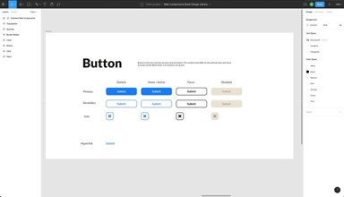

# Компонент ButtonComponent

## О проекте

В этом проекте мы реализуем пользовательский встроенный элемент `ButtonComponent`.

В предыдущем проекте мы написали *автономный пользовательский элемент* - наиболее гибкий способ создания Веб Компонентов, позволяющий задать логику компонента в мельчайших деталях.

Если мы решим реализовать кнопку также как автономный элемент, то по сути наш класс будет простой оберткой над нативным элементом, что потребует довольно большого объема работы даже без добавления  какого-либо дополнительного функционала. При этом мы потеряем все a11y-характеристики нативной кнопки, заложенные для скринридеров и поисковых движков.

*Пользовательские встроенные элементы* позволяют расширять характеристики нативных элементов. Так, наследуясь от `HTMLButtonElement` вместо `HTMLElement`, мы унаследуем все характеристики нативной кнопки, существенно снизив объем кода.

Какие минусы есть у *пользовательских встроенных элементов*? Например, лишь малая часть нативных элементов могут использовать теневой DOM: `HTMLBodyElement`, `HTMLDivElement`, `HTMLHeadingElement`, `HTMLParagraphElement` и `HTMLSpanElement`. То есть для большинства случаев нет возможности инкапсулировать стили в элемент. Поэтому стилизация производится классически, в глобальных таблицах, например в `<head>` документа, и тут также есть своя сложность: если такой элемент находится внутри теневого DOM другого элемента, глобальные стили не смогут пройти его границу (впрочем, будет разобран способ решить эту проблему). В нашем случае кнопка будет далее размещена в слоте элемента *CardComponent*, а значит проблем с видимостью стилей не возникнет.

## Что мы изучим

- пользовательские встроенные элементы,
- программная стилизация через глобальные таблицы,
- стори для вариантов и состояний,
- документирование компонентов в *Storybook*,
- как писать снэпшот-тесты и скриншот-тесты.

## Требования к приемке

Компонент `ButtonComponent`

- поддерживает три варианта использования (primary, secondary, icon),
- реализует поведение в четырех особых состояниях (hover, active, focus, disabled),
- стилизован через глобальные таблицы,
- также поддерживает стилизацию в контексте теневого DOM другого элемента,
- документирован в `Storybook`,
- снэпшот-тест и скриншот-тест проверяют реализацию дизайна и разметки.
