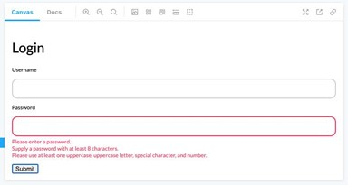

# Компонент `<input-text>`

## О проекте

В этом проекте мы будем работать над элементом `TextInputComponent`: текстовым полем ввода со встроенной валидацией. Когда пользователь перемещает фокус с элемента с помощью мыши или клавиатуры, наш элемент должен производить валидацию значения и давать обратную связь пользователю. Также, если элемент находится внутри формы, его значение должно быть включено в объект `FormData` элемента `HTMLFormElement`.

Для каждого из состояний `TextInputComponent` (default, error, disabled) будут разработаны стори и написаны тесты, как через `Playwright`, так и с использованием внутренних средств `Storybook`.

## Что мы изучим

- пользовательские элементы, связанные с формой,
- жизненный цикл таких элементов,
- их участие в процессах отправки форм и валидации,
- обработку состояний disabled и error и их стилизацию,
- отслеживание изменений атрибутов,
- взаимодействие пользовательских элементов с дочерними узлами,
- взаимодействие пользовательских элементов с родителем.

## Требования к приемке

- класс `TextInputComponent` экспортирован из `src/lib/components/TextInput/TextInput.ts`;
- `TextInputComponent` стилизован согласно макетам [Figma](https://www.figma.com/file/QXGa6qN6AqgeerCtS28I8z/Web-Components-Book-Design-Library?node-id=324%3A101);
- `TextInputComponent` поддерживает те же атрибуты, что и `HTMLInputElement`;
- реализованы стори для отображения поведения компонента в следующих состояниях: по умолчанию, фокус, отключен, ошибка;
- написаны интеграционные, снэпшот и скриншот-тесты на базе `Playwright`;
- написаны тесты с использованием внутренних средств `Storybook`.
