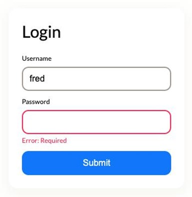

# Компонент `<login-form>`

## О проекте

Мы будем разрабатывать форму логина `<login-form>`, продолжая использовать `Storybook` как инструмент визуального представления (здесь будет уже не одна стори) и тестируя не только с помощью `Playwright`, но и с использованием `Storybook Test Runner`.

## Что мы изучим

- жизненный цикл пользовательских элементов,
- обработку и делегирование событий,
- доступность (a11y) элементов,
- валидацию форм,
- закрепим работу с теневым DOM и шаблонами.

## Требования к приемке

- из `packages/component/src/card/Card.ts` экспортируется класс `CardComponent`;
- `CardComponent` может принимать в шаблон изображения, текст, ссылки и заголовки;
- `CardComponent` стилизован на основе шаблоны Figma;
- `CardComponent` можно настроить через контролы Storybook;
- реализованы интеграционные тесты на базе `Playwright`,
- снэпшот-тест и скриншот-тест проверяют реализацию дизайна `CardComponent`.
