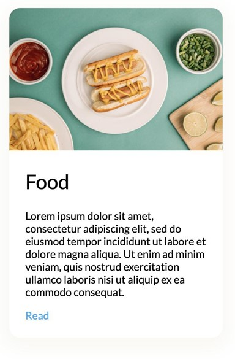

# Стилизация `<card-component>`

*Дизайн компонента всё так же доступен в [Figma](https://www.figma.com/file/QXGa6qN6AqgeerCtS28I8z/Web-Components-Book-Design-Library?node-id=331%3A24)*

## CSS-переменные

Начинать работу над библиотекой компонентов логично с наименьших единиц дизайн-системы - дизайн-токенов. Для их реализации используют CSS-переменные. CSS-переменные доступно отовсюду: и в обычном DOM, и в теневом.

Имена им назначают в соответствии с токенами из дизайн-системы: это могут быть *--color*, *--font*, *--margin* и так далее.

В данном проекте они уже назначены и расположены в `src/lib/global.css`.

```css
/* src/lib/global.css */

:root {
/* ... */
    --color-black: rgba(0, 0, 0, 1);
    --font-default: 'Lato', sans-serif;
    --font-headline: 'Lato Black', sans-serif;
    --font-weight-default: 400;
/* ... */
}
```

## Стилизация с :host

В соответствием с макетом Figma, внешний контейнер элемента должен иметь цветной фон, сглаженные углы, тень, и быть ограниченным максимальной шириной в 320px. Для стилизации контейнера (самого хостового элемента `<card-component>`) используется псевдоселектор `:host`. Он работает только внутри теневого DOM и выбирает хостовой элемент.

Начнем вести стилизацию внутри шаблона.

```ts
// src/lib/component/card/Card.ts

export class CardComponent extends HTMLElement {
    constructor() {
        super();
        const template = document.createElement('template');

        template.innerHTML = `
            <style>
                :host {
                    display: block;
                    background: var(--color-white);
                    border-radius: var(--radius-md);
                    box-shadow: var(--shadow);
                    overflow: hidden;
                    max-width: 320px;
                }
            </style>

            <article>
                <header><slot name="header"></slot></header>
                <section><slot name="content"></slot></section>
                <footer><slot name="footer"></slot></footer>
            </article>
        `

        const shadowRoot = this.attachShadow({ mode: 'open' });
        shadowRoot.appendChild(template.content.cloneNode(true));
    }
}

customElements.define('card-component', CardComponent);
```

## Псевдоселектор ::slotted

Теневой DOM инкапсулирует шаблон компонента, и теперь CSS из обычного DOM, `<style>` описанный в `<head>` не может пройти через границы теневого DOM. И наоборот, стили из `<style>` внутри шаблона компонента не будут доступны в обычном DOM.

Но, несмотря на сказанное выше, элементы, проецируемые в слоты шаблона, принадлежат обычному DOM. Поэтому бывает непросто решить, где стилизовать содержимое слотов: в обычном DOM или в теневом. Являясь элементами обычного DOM, они могут быть стилизованы в глобальных таблицах, и это может быть неплохим решением для тех правил, которые применимы ко всему приложению или к значимой его части. Внутри теневого DOM к ним можно получить доступ через псевдоселектор `::slotted`. Можно использовать комбинацию этих двух подходов.

Для примера рассмотрим стилизацию элемента `<a>`, переданного в элемент `<slot>`.

Первый селектор расположен в глобальной таблице стилей и задает всем ссылкам оформление опираясь на дизайн-токены:

```css
/* src/lib/global.css */

/* ... */
a:link, a:visited {
    font-family: var(--font-default);
    font-weight: var(--font-weight-default);
    font-size: var( --font-body-md);
}
/* ... */
```


Второй расположим внутри компонента, чтобы он дополнял эти правила блочным отображением.

```ts
/* src/lib/components/Card/Card.ts */

// ...
    template.innerHTML = `
        <style>
            :host {
                display: block;
                background: var(--color-white);
                border-radius: var(--radius-md);
                box-shadow: var(--shadow);
                overflow: hidden;
                max-width: 320px;
            }
            ::slotted(a:link), ::slotted(a:visited) {
                display: block;
            }
        </style>
        // ...
    `
// ...
```

Оба блока правил будут каскадно применены к элементам внутри слота.

Далее, по дизайн-макету видно, что контент внутри слотов имеет горизонтальный паддинг. Если мы назначим его на элементы `<header>`, `<section>` и `<footer>`, это не даст изображениям занять полную ширину, поэтому зададим его также через ::slotted. Чтобы обратиться ко всем слоттед-элементам, используем селектор `*`, означающий "все".

```ts
/* src/lib/components/Card/Card.ts */

// ...
    template.innerHTML = `
        <style>
            // ...
            ::slotted(*) {
                padding-left: var(--padding-lg);
                padding-right: var(--padding-lg);
            }
        </style>
        // ...
    `
// ...
```

There seems to be a margin below the last element in the card. Target the last slotted element with the :last-child pseudo selector and apply the margin specified in Figma using a CSS variable.

```ts
/* src/lib/components/Card/Card.ts */

// ...
    template.innerHTML = `
        <style>
            // ...
            ::slotted(:last-child) {
                padding-bottom: var(--margin-lg);
            }
        </style>
        // ...
    `
// ...
```

Наконец, стилизуем изображения: сбросим внутренние отступы и настроим ширину на 100%

```ts
/* src/lib/components/Card/Card.ts */

// ...
    template.innerHTML = `
        <style>
            // ...
            ::slotted(img) {
                width: 100%;
                padding-left: 0px;
                padding-right: 0px;
            }
        </style>
        // ...
    `
// ...
```

Если всё сделано правильно, компонент должен выглядеть примерно так



Итак, мы стилизовали компонент используя CSS-переменные, которые доступны как в обычном DOM, так и в теневом, стилизовали хостовой компонент через :host, слоттед-элементы - через :slotted. На этом реализация компонента почти завершена.
