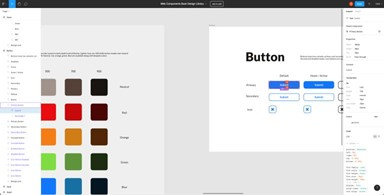
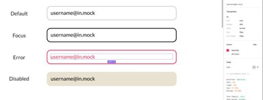
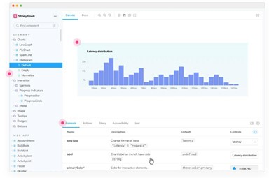

## Figma

It’s practical to look at Web Components through the lens of a design system. Web Components uses tokens as building blocks for developing a reuseable user interface. Web Components can display in different orientations or states: a layout. Web Components can also be part of another layout compromised of one or many components.

Design systems offer guidance for developing user interfaces.

https://www.figma.com/file/QXGa6qN6AqgeerCtS28I8z/Web-Components-Book-Design-Library

In Figma, you can reference different values of design tokens and inspect and measure parts of UI components and layouts. Take a moment and familiarize yourself with the Figma interface. On the left sidebar is a navigation menu that lists different layers in the focused artboard. When you click on elements in the artwork, various properties of the selected element are displayed in the right sidebar.

Whenever an element is selected, the color of that element is displayed in the right sidebar by token name followed by the hexidecimal value of the color.

A global CSS stylesheet provided in the development environment for this book contains CSS variables that map to each design token. To use the Red/300 token, you’d reference the --color-red-300 CSS variable:

color: var(--color-red-300);

Similarly, CSS variables for sizing, border radius, font, icons and box shadow are provided on the global stylesheet found in sr-c/style/style.css. You may reference these CSS variables when styling each UI component.

## Storybook

The main development environment for a considerable portion of this book is Storybook¹⁰, “an open source tool for building UI components and pages in isolation.”

Storybook is run locally on your computer. In several chapters, you’ll define Stories for the UI component you’re coding. A Story is a configurable template that hosts your component. Through the Storybook user interface, you can define different controls that change UI component behavior. By the end of this book you should have a good understanding of how to develop and maintain UI components in Storybook.

#### Development lifecycle of a UI component in Storybook:

1.	Reference the mockup in Figma
2.	Define the story in Storybook
3.	Style the component with design tokens
4.	Develop behaviors with JavaScript / TypeScript
5.	Write tests

#### Storyshots

Storyshots¹² is a Storybook addon you’ll use to generate automatic visual snapshots for each UI component.

## Cypress

Cypress¹¹ is a test runner you’ll use to write end-to-end tests for each UI component.

## Monorepo

When developing against the content in this book, you’ll be work-ing in a monorepo built with lerna¹³. Lerna allows you to manage multiple projects in the same repository. Those projects are defined as:

•	client web application front end

•	common reusable functions, utilities

•	component UI library

•	server web application back end

•	style resources exported from the design system such as CSS styles, icons, fonts

Throughout the book, you’ll switch between different projects in the repository depending on what you’re currently working on. When developing UI components, you’ll work in the component directory. If you’re developing the web application, you’ll code in files found in the client or server directories.
