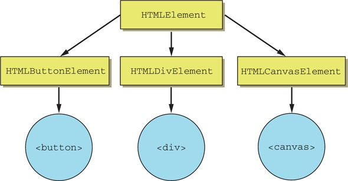

# Custom Elements

Эта спецификация является основой для разработки Веб Компонентов, ведь именно она дала возможность разработчикам расширять существующие нативные элементы, а также создавать новые HTML-элементы с нуля или на основе внешних кодовых баз. Это поддерживаемый веб-стандартами путь к созданию переиспользуемых компонентов на ванильных JS/HTML/CSS.

Мы можем создавать пользовательские HTML-элементы, описываемые нашим классом, со своими методами и свойствами, событиями и так далее. Мы можем определить их с помощью специального класса, а затем использовать, как если бы они всегда были частью HTML.

Когда мы добавляем элемент на страницу, нас редко волнует, как он работает внутри, но сейчас придется разобраться. Вспомним концепцию наследования, основу объектно-ориентированного программирования. Почти все элементы, которые мы размещаем в HTML/DOM, наследуются от класса `HTMLElement`. Так, элементы `<span>`, `<div>` и `<button>` создаются через `HTMLSpanElement`, `HTMLDivElement` и `HTMLButtonElement` соответственно. Все они наследуются от `HTMLElement`.



Если выполнить в браузере команду `document.createElement('div').constructor`, консоль вернет `ƒ HTMLDivElement() { [native code] }`.

Существует два вида пользовательских элементов:
1. Автономные пользовательские элементы – «полностью новые» элементы, расширяющие абстрактный класс HTMLElement.
2. Пользовательские встроенные элементы – элементы, расширяющие встроенные, например кнопку HTMLButtonElement и т.п.

Сначала мы познакомимся с их общими чертами, затем - с пользовательскими встроенными элементами, а после - перейдем к автономным.

## Спецификация пользовательских компонентов

Чтобы создать пользовательский элемент, нам нужно сообщить браузеру ряд деталей о нём: как его показать, что делать, когда элемент добавляется или удаляется со страницы и т.д.

```js
{
  constructor() {
    super();
    // элемент создан
    // можно выполнить предварительную настройку, но рендерить еще рано
  }

  connectedCallback() {
    // браузер вызывает этот метод при добавлении элемента в документ
    // может вызываться много раз, если элемент многократно добавляется/удаляется
    // здесь мы обычно задаем содержимое элемента (разметку) и рендерим его
  }

  disconnectedCallback() {
    // браузер вызывает этот метод при удалении элемента из документа
    // может вызываться много раз, если элемент многократно добавляется/удаляется
  }

  static get observedAttributes() {
    return [/* массив имён атрибутов для отслеживания их изменений */];
  }

  attributeChangedCallback(name, oldValue, newValue) {
    // вызывается при изменении одного из перечисленных выше атрибутов
  }

  adoptedCallback() {
    // вызывается, когда элемент перемещается в новый документ
    // используется очень редко
  }

  // специфичные для элемента свойства и методы

  // пользовательские вспомогательные свойства и методы
}
```

Видим, что методов не много, и все они являются необязательными.

Итак, мы создаем класс с необходимыми нам методами, наследуясь от класса `HTMLElement` в случае автономных пользовательских элементов либо от более специфичного класса в случае со встроенными пользовательскими элементами. Далее - реализуем собственные вспомогательные функции, если нужно - стилизуем.

После этого регистрируем элемент через предназначенный для этого метод `customElements.define`, задавая ему название. Важно, что название должно содержать дефис, во избежание коллизий с нативными элементами. Так, *ui-div* будет корректным именованием, а *uidiv* и *div* - нет.

Готово - теперь можем использовать элемент как через HTML (просто добавить в документ, как любой нативный тег), так и через JS (createElement).

Важно понимать порядок рендеринга: когда HTML-парсер строит DOM, элементы обрабатываются друг за другом, родители до детей. Например, если у нас есть `<outer><inner></inner></outer>`, то элемент `<outer>` создаётся и включается в DOM первым, а затем `<inner>`. Это приводит к важным последствиям для пользовательских элементов: так, если пользовательский элемент пытается получить доступ к *innerHTML* в *connectedCallback*, он ничего не получает. Это происходит именно потому, что на этой стадии ещё не существуют дочерние элементы, DOM не завершён. HTML-парсер подключил пользовательский элемент `<user-info>` и теперь собирается перейти к его дочерним элементам, но пока не сделал этого. Если мы хотим передать информацию в пользовательский элемент, мы можем использовать атрибуты (они доступны сразу), отложить доступ к ним через setTimeout с нулевой задержкой (костыль, но работает), либо реализовать свой механизм общения между родителями и детьми через механизм `Custom Events`.

## Пользовательские встроенные элементы

Пользовательские встроенные элементы позволяют наследовать характеристики нативных элементов браузера, расширяя их функционал. Мы должны выбрать подходящий базовый класс, реализовать необходимую нам часть спецификации, описанной выше, добавить желаемый функционал и стили, зарегистрировать элемент в реестре, и его можно использовать.

Наследуясь от нативных элементов мы даем пользователю возможность взаимодействовать с чем-то уже знакомым ему. Также - снижаем сложность разработки, ведь нам не требуется переизобретать то, что уже работает - свойства, методы, синхронизацию с HTML-аттрибутами. С точки зрения доступности (a11y) такие элементы - также отличная точка старта для типовых задач.

#### FancyButton
Допустим, мы хотим создать свою версию `<button>`, значит наследоваться будем от `HTMLButtonElement`.

```js
class FancyButton extends HTMLButtonElement {
    constructor() {
        super();
        this.addEventListener('click', e => this.drawRipple(e));
    }

    drawRipple(event) {
        const circle = document.createElement("span");
        const radius = Math.max(this.clientWidth, this.clientHeight) / 2;
        circle.style.width = circle.style.height = `${radius}px`;
        circle.style.left = `${event.clientX - (this.offsetLeft + radius)}px`;
        circle.style.top = `${event.clientY - (this.offsetTop + radius)} px`;
        circle.classList.add("ripple");
        this.appendChild(circle);
    }
}

customElements.define('fancy-button', FancyButton, { extends: 'button' });
```

<iframe src="/custom-element-button.html"  />

Registering customized built-in elements is done the same way. However, calling define requires a third argument that specifies an Object that sets the extends property to the tag name of the element that you’re extending from.

To use the customized built-in element in a template, the element must use the required is attribute set to the name of the element in the CustomElementRegistry. This is mainly so that browsers can parse the custom element from HTML source.

Customized built-in elements can be created dynamically with document.createElement by adding a second argument when call-ing the function.

Notice that the call to define() changes slightly when extending a native element. The required third parameter tells the browser which tag you're extending. This is necessary because many HTML tags share the same DOM interface. `<section>`, `<address>`, and `<em>` (among others) all share HTMLElement; both `<q>` and `<blockquote>` share HTMLQuoteElement; etc… Specifying {extends: 'blockquote'} lets the browser know you're creating a souped-up `<blockquote>` instead of a `<q>`.

Note: Extending HTMLButtonElement endows our fancy button with all the DOM properties/methods of `<button>`. That checks off a bunch of stuff we don't have to implement ourselves: disabled property, click() method, keydown listeners, tabindex management.

Consumers of a customized built-in element can use it in several ways. They can declare it by adding the is="" attribute on the native tag:

```html
<button is="fancy-button" disabled>Fancy button!</button>
```

Сreate an instance in JavaScript:

```js
let button = document.createElement('button', {is: 'fancy-button'});
button.textContent = 'Fancy button!';
button.disabled = true;
document.body.appendChild(button);
```

or use the new operator:

```js
let button = new FancyButton();
button.textContent = 'Fancy button!';
button.disabled = true;
```

#### Lazy Image

```js
customElements.define('bigger-img', class extends Image {
  // Give img default size if users don't specify.
  constructor(width=50, height=50) {
    super(width * 10, height * 10);
  }
}, {extends: 'img'});
```

Users declare this component as:

```html

```

or create an instance in JavaScript:

```js
const BiggerImage = customElements.get('bigger-img');
const image = new BiggerImage(15, 20); // pass constructor values like so.
console.assert(image.width === 150);
console.assert(image.height === 200);
```

## Дополнительная информация
Полифилл https://github.com/webcomponents/polyfills/tree/master/packages/custom-elements
